# DistMesh - A Simple Mesh Generator in MATLAB

### News (v1.2)
**DistMesh v1.2** modernizes the original code in several ways:
* **Pure MATLAB:** All C/MEX binaries have been removed. The code is now fully portable and JIT-optimized.
* **Ease of Use:** Simply add the folders to your path (or run `startup.m`) and it works.
* **Open Source:** The license has been changed to the **MIT License**.

## Description

DistMesh is a simple MATLAB code for generation of unstructured triangular and tetrahedral meshes. It was developed by [Per-Olof Persson](https://persson.berkeley.edu) (now at [UC Berkeley](http://www.berkeley.edu)) and [Gilbert Strang](http://www-math.mit.edu/~gs) in the [Department of Mathematics](http://www-math.mit.edu) at [MIT](http://www.mit.edu). A detailed description of the program is provided in our SIAM Review paper, see documentation below.

One reason that the code is short and simple is that the geometries are specified by *Signed Distance Functions*. These give the shortest distance from any point in space to the boundary of the domain. The sign is negative inside the region and positive outside. A simple example is the unit circle in 2-D, which has the distance function *d=r-1*, where *r* is the distance from the origin. For more complicated geometries the distance function can be computed by interpolation between values on a grid, a common representation for level set methods.

For the actual mesh generation, DistMesh uses the Delaunay triangulation routine in MATLAB and tries to optimize the node locations by a force-based smoothing procedure. The topology is regularly updated by Delaunay. The boundary points are only allowed to move tangentially to the boundary by projections using the distance function. This iterative procedure typically results in very well-shaped meshes.

Our aim with this code is simplicity, so that everyone can understand the code and modify it according to their needs. The code is not entirely robust (that is, it might not terminate and return a well-shaped mesh), and it is relatively slow. However, our current research shows that these issues can be resolved in an optimized C++ code, and we believe our simple MATLAB code is important for demonstration of the underlying principles.

## Download

You can download DistMesh directly from this repository:

* **Clone via Git:**
    ```bash
    git clone https://github.com/popersson/DistMesh.git
    ```
* **Download ZIP:** Click the green **Code** button at the top of this page and select **Download ZIP**.
* **Specific Versions:** You can find both all releases on the [Releases page](../../releases).

DistMesh is distributed under the [MIT License](https://opensource.org/license/MIT); see the [License and Copyright](LICENSE) notice for more information.

## Quick Start

1.  **Clone or Download** this repository.
2.  **Open MATLAB** and navigate to the `DistMesh` folder.
3.  Run the `startup` script to set the path.
4.  Copy/paste one of the examples below to generate a sample mesh.

## New Julia version

If you prefer the [Julia language](https://julialang.org/), consider this [new Julia version of DistMesh](https://github.com/JuliaGeometry/DistMesh.jl). It is significantly faster than the original MATLAB code and the interface is modernized. Currently only 2D support.

## Documentation

* P.-O. Persson, G. Strang, **A Simple Mesh Generator in MATLAB**.
    *SIAM Review*, Volume 46 (2), pp. 329-345, June 2004 ([PDF](https://persson.berkeley.edu/pub/persson04mesh_col.pdf))
* P.-O. Persson, **Mesh Generation for Implicit Geometries**.
    *Ph.D. thesis, Department of Mathematics, MIT*, Dec 2004 ([PDF](https://persson.berkeley.edu/thesis/persson-thesis-color.pdf))
* [Function reference](docs/funcref.md)

## Gallery

* [Images](https://persson.berkeley.edu/distmesh/gallery_images.html)
* [Movies](https://persson.berkeley.edu/distmesh/gallery_movies.html)


## Examples

**Example: (Uniform Mesh on Unit Circle)**

```matlab
fd=@(p) sqrt(sum(p.^2,2))-1;
[p,t]=distmesh2d(fd,@huniform,0.2,[-1,-1;1,1],[]);
```
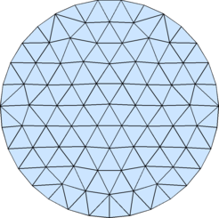

**Example: (Rectangle with circular hole, refined at circle boundary)**

```matlab
fd=@(p) ddiff(drectangle(p,-1,1,-1,1),dcircle(p,0,0,0.5));
fh=@(p) 0.05+0.3*dcircle(p,0,0,0.5);
[p,t]=distmesh2d(fd,fh,0.05,[-1,-1;1,1],[-1,-1;-1,1;1,-1;1,1]);
```
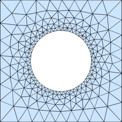

**Example: (Polygon)**

```matlab
pv=[-0.4 -0.5;0.4 -0.2;0.4 -0.7;1.5 -0.4;0.9 0.1;
    1.6 0.8;0.5 0.5;0.2 1;0.1 0.4;-0.7 0.7;-0.4 -0.5];
[p,t]=distmesh2d(@dpoly,@huniform,0.1,[-1,-1; 2,1],pv,pv);
```
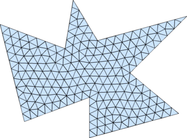

**Example: (Ellipse)**

```matlab
fd=@(p) p(:,1).^2/2^2+p(:,2).^2/1^2-1;
[p,t]=distmesh2d(fd,@huniform,0.2,[-2,-1;2,1],[]);
```
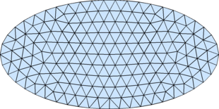

**Example: (Square, with size function point and line sources)**

```matlab
fd=@(p) drectangle(p,0,1,0,1);
fh=@(p) min(min(0.01+0.3*abs(dcircle(p,0,0,0)), ...
             0.025+0.3*abs(dpoly(p,[0.3,0.7; 0.7,0.5]))),0.15);
[p,t]=distmesh2d(fd,fh,0.01,[0,0;1,1],[0,0;1,0;0,1;1,1]);
```
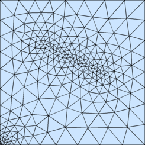

**Example: (NACA0012 airfoil)**

```matlab
hlead=0.01; htrail=0.04; hmax=2; circx=2; circr=4;
a=.12/.2*[0.2969,-0.1260,-0.3516,0.2843,-0.1036];

fd=@(p) ddiff(dcircle(p,circx,0,circr),(abs(p(:,2))-polyval([a(5:-1:2),0],p(:,1))).^2-a(1)^2*p(:,1));
fh=@(p) min(min(hlead+0.3*dcircle(p,0,0,0),htrail+0.3*dcircle(p,1,0,0)),hmax);

fixx=1-htrail*cumsum(1.3.^(0:4)');
fixy=a(1)*sqrt(fixx)+polyval([a(5:-1:2),0],fixx);
fix=[[circx+[-1,1,0,0]*circr; 0,0,circr*[-1,1]]'; 0,0; 1,0; fixx,fixy; fixx,-fixy];
box=[circx-circr,-circr; circx+circr,circr];
h0=min([hlead,htrail,hmax]);

[p,t]=distmesh2d(fd,fh,h0,box,fix);
```
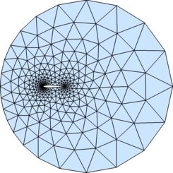

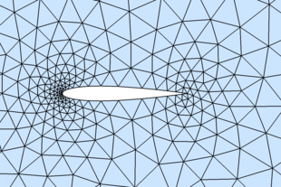

**Example: (Uniform Mesh on Unit Sphere)**

```matlab
fd=@(p) dsphere(p,0,0,0,1);
[p,t]=distmeshsurface(fd,@huniform,0.2,1.1*[-1,-1,-1;1,1,1]);
```
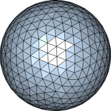

**Example: (Graded Mesh on Unit Sphere)**

```matlab
fd=@(p) dsphere(p,0,0,0,1);
fh=@(p) 0.05+0.5*dsphere(p,0,0,1,0);
[p,t]=distmeshsurface(fd,fh,0.15,1.1*[-1,-1,-1;1,1,1]);
```
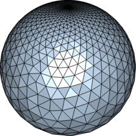

**Example: (Uniform Mesh on Torus)**

```matlab
fd=@(p) (sum(p.^2,2)+.8^2-.2^2).^2-4*.8^2*(p(:,1).^2+p(:,2).^2);
[p,t]=distmeshsurface(fd,@huniform,0.1,[-1.1,-1.1,-.25;1.1,1.1,.25]);
```
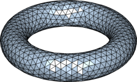

**Example: (Uniform Mesh on Ellipsoid)**

```matlab
fd=@(p) p(:,1).^2/4+p(:,2).^2/1+p(:,3).^2/1.5^2-1;
[p,t]=distmeshsurface(fd,@huniform,0.2,[-2.1,-1.1,-1.6; 2.1,1.1,1.6]);
```
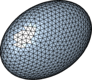

---

Per-Olof Persson
Department of Mathematics, UC Berkeley
persson@berkeley.edu
